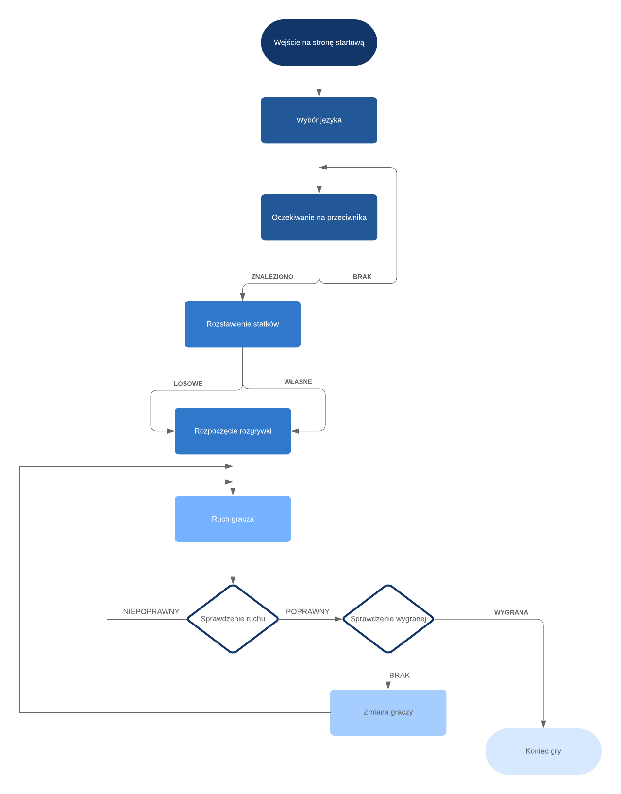

# About battleship
Battleship game for two players. At the beginning, players set their ships (randomly or by selecting fields),
there are available ships: 1x4-mast, 2x3-mast, 3x2-mast and 4x1-mast.
When they are ready, start a game in which each of them has its own movement until he hits the ship.
The player who first sinks all ships wins. Ships can not touch, be slanted, or leave the board.

Flowchart of application:

## Prerequisites
Java 11, Maven 3.6.0

## Running
use command: mvn clean install

